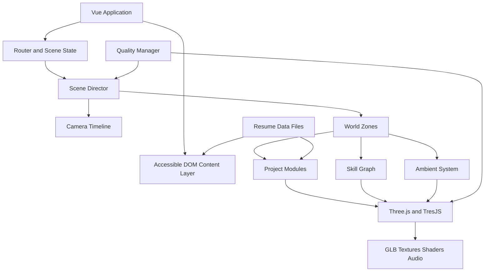

# 陈友红 3D 个人网站架构与开发计划

> 项目代号：**CYH // SIGNAL TERRAIN**  
> 技术约束：Vue 3 + JavaScript + Vite + Three.js 生态  
> 文档日期：2026-08-13  
> 信息来源：`C:\Users\16092\Desktop\个人文档\陈友红 - 副本 - 副本.docx`

---

## 1. 项目结论

这个网站不应被设计成“普通简历页面加一个会旋转的 3D 模型”，而应成为一座**可以进入、探索和操控的个人数字孪生空间**。

陈友红的经历有一条非常明确的主线：从后台、H5、小程序，到地图可视化、网络质量大屏，再到 Cesium / EarthSDK3 / 3D Tiles / GLB / WebSocket 驱动的数字孪生系统。网站的核心叙事因此确定为：

> **把复杂业务、实时数据和地理空间，转化为清晰、可交互、可操作的前端体验。**

网站的首要目标不是展示“我会多少技术名词”，而是在 60-90 秒内让招聘者或技术负责人形成三个判断：

1. 这是一个有约 4 年以上实际项目经验的前端工程师。
2. 其差异化能力是数据可视化、地图与三维数字孪生，而非普通后台页面开发。
3. 不仅能实现视觉效果，也理解实时数据、业务模块、状态联动和工程化交付。

---

## 2. 简历信息提炼

### 2.1 基本定位

- 姓名：陈友红
- 求职方向：Web 前端开发工程师
- 学历：本科
- 教育经历：重庆三峡学院，信息管理与信息系统，2017.09-2021.06
- 工作经历：
  - 重庆软博科技，前端开发工程师，2024.10-至今
  - 重庆同远影像科技，前端开发工程师，2023.10-2024.02
  - 重庆纵浪科技有限公司，前端开发工程师，2021.11-2023.07

### 2.2 差异化能力

| 能力层 | 简历证据 | 网站中的表达方式 |
| --- | --- | --- |
| Vue 工程能力 | Vue2 / Vue3、Vuex / Pinia、Vue Router、Axios | 整体应用架构、路由、场景状态和内容系统 |
| 三维可视化 | EarthSDK3、Cesium、3D Tiles、GLB | 核心 3D 世界、数字孪生项目展区 |
| 地图与空间数据 | BMapGL、MapVGL、点位、热力图 | 地形网格、热力表面、空间点位和镜头定位 |
| 实时数据 | MQTT / WebSocket、车辆轨迹、设备状态 | 实时数据脉冲、车辆轨迹和状态广播动画 |
| 数据可视化 | ECharts、大屏、雷达图、排行、能耗与客流 | 立体数据柱、曲线、雷达体和空间标签 |
| 多端交付 | H5、小程序、Uniapp、后台系统 | 作品类型切换和多端设备陈列区 |
| 业务理解 | 服务区运营、网络运维、ERP、电商、摄影业务 | 每个项目用“问题-职责-结果”而非技术堆砌来讲述 |

### 2.3 重点项目优先级

网站不应平均分配篇幅。建议采用以下层级：

1. **旗舰项目：黎香湖智慧服务区平台**  
   最能证明 Vue3、Cesium、数字孪生、GLB、实时车辆和复杂业务整合能力，应占整个作品空间约 40%。

2. **核心项目：网络质量业务评估大屏**  
   证明地图、热力图、ECharts、多层级筛选与运维决策支持能力。

3. **组合项目：安徽电信 / 海联联通热力图 / 信令大模型**  
   用于展示电信数据、地图大屏和 AI 平台的业务跨度。

4. **业务工程项目组**  
   大片来了、ERP、商城、企业微信 H5、Uniapp 小程序作为一个“多端业务系统舱”，证明完整前端工程经验。

### 2.4 公开隐私策略

公开网站默认不直接展示完整手机号、生日和私人邮箱。建议：

- 首页只展示城市、岗位方向、工作年限和可联系状态。
- 联系区使用邮件按钮或表单，邮箱可做轻度混淆。
- 电话只出现在可下载的受控简历中，或由本人确认后公开。
- 生日不属于求职作品集的必要信息，公开版删除。
- 项目截图、地图、客户名称和业务数据上线前需确认脱敏与授权。

---

## 3. 创意概念：Signal Terrain

### 3.1 一句话概念

访客进入一片持续运行的三维“信号地形”：道路、建筑、热力、车辆、设备节点和数据流共同组成陈友红的职业履历；每段经历不是卡片，而是这个世界中的一个可进入区域。

### 3.2 为什么这个概念适合本人

- “地形”对应地图、Cesium、3D Tiles 与数字孪生经验。
- “信号”对应电信网络、WebSocket、车辆轨迹和设备状态。
- “持续运行”对应工程系统，而非静态视觉海报。
- 访客的镜头移动就是阅读顺序，空间距离就是职业时间。

### 3.3 记忆点

网站唯一的主视觉签名是一个**会实时重构的服务区 / 城市拓扑沙盘**：

- 初始状态是一张抽象的二维数据网格。
- 姓名出现时，网格被数据脉冲抬升成地形与建筑。
- 相机沿一条发光道路进入场景，道路年份从 2021 延伸到现在。
- 鼠标、触控或滚动会改变扫描层，依次显露车辆轨迹、网络热力、能耗、设备与项目节点。
- 最终所有信号汇聚成 `CHEN YOUHONG / FRONTEND SYSTEMS` 标识。

这个设计风险是有意的：不使用常见的宇宙、星球、漂浮玻璃卡片或赛博城市模板，而把本人真实做过的“道路服务区 + 网络信号 + 实时数据”变成独有世界。

---

## 4. 视觉系统

### 4.1 视觉气质

- 关键词：精密、克制、实时、空间感、工程感、有生命的系统
- 避免：满屏霓虹、紫蓝渐变、廉价 HUD、过量故障字、所有内容都发光
- 3D 是信息结构，不是背景装饰
- 重点区域高亮，其余环境保持低对比，让文字和交互目标始终清晰

### 4.2 色彩令牌

| 角色 | 色值 | 用途 |
| --- | --- | --- |
| Carbon | `#080A0F` | 主背景与深色空间 |
| Mist | `#E8EFF0` | 主要文字与高亮表面 |
| Teal Signal | `#32D6C5` | 路径、实时数据、可交互目标 |
| Lime Data | `#C7F15B` | 成功状态、技能节点、关键指标 |
| Coral Alert | `#FF6B5F` | 告警、项目难点、重要交互反馈 |
| Steel | `#65717C` | 次级结构、网格、辅助文字 |

颜色不按章节机械切换，而按数据语义使用：实时数据是青绿色、结果与能力是黄绿色、问题与挑战是珊瑚红。

### 4.3 字体建议

- 中文展示：得意黑或其他有授权的窄体中文展示字体，仅用于姓名与大标题
- 中文正文：HarmonyOS Sans SC
- 英文展示：Space Grotesk
- 数据与代码：JetBrains Mono
- 字体使用本地 WOFF2，避免外部字体阻塞与隐私请求

### 4.4 空间与材质

- 地面：暗色哑光地形，带微弱等高线，不使用镜面黑地板
- 建筑：低多边形实体 + 局部线框剖面
- 数据：实例化点、短线段、流动轨迹、立体柱和半透明热力层
- 项目节点：真实空间对象，例如服务区模型、通信塔、设备站点、移动终端，不使用漂浮圆角卡片
- 文本：主要信息使用可访问 DOM 文本层，并通过世界坐标锚定到 3D 对象；少量大标题可用 MSDF 3D Text

---

## 5. 信息架构与空间动线

全站采用**单页持续 3D 世界**，Vue Router 提供可分享的深链接。相机在同一个 WebGL 场景中移动，避免每个页面创建独立 Canvas 和重复加载资源。

```text
/                       入口：身份与主张
/world                  空间总览
/experience             工作经历主路线
/project/li-xiang-hu    黎香湖智慧服务区
/project/network        网络质量业务评估
/project/telecom-ai     电信、热力图与信令大模型
/project/business       后台、H5、小程序项目组
/skills                 技术能力空间
/about                  教育、自我评价与工作方式
/contact                联系与简历下载
```

### 5.1 场景章节

#### A. Boot / 系统启动

- 0-3 秒内完成能力检测、核心资源加载和首屏文本显示。
- 不做虚假百分比；加载进度由真实资源管理器提供。
- 入口只有姓名、岗位与“进入空间”命令。
- 首次进入给出 3 秒以内的轻量交互提示，之后不再打扰。

#### B. Identity Field / 身份场

- 相机贴近地面，数据扫描让地形从平面升起。
- 姓名作为第一视口主信号，不能只放在角落导航。
- 文案建议：`我把复杂业务，构造成可看、可懂、可操作的空间。`
- 显示：前端工程师、Vue / Data / Map / 3D、重庆、工作年限。

#### C. Career Route / 职业路线

- 一条真实可辨识的道路代表 2021 至今的职业时间。
- 三家公司是沿路的空间站点，不使用普通竖向时间轴。
- 聚焦站点时，环境只显示公司、时间、角色和一条成长结论。
- 继续进入后才展示项目，避免首屏信息过载。

#### D. Twin District / 黎香湖数字孪生区

- 微缩服务区作为全站最复杂场景。
- 通过模式切换展示：车辆轨迹、停车位吸附、设备点位、摄像头、电子围栏、天气和时间光照。
- 项目详情分为“业务目标、我的职责、关键实现、最终价值”。
- 不复刻客户真实数据，使用脱敏的程序化模拟数据。

#### E. Signal Basin / 网络质量区

- 地形表面以高度和颜色表现网络质量。
- 全国 / 地市 / 区县切换被表达为镜头尺度变化。
- 点选质差区域后，空间雷达体、排名柱和热力层联动。
- 强调“帮助运维人员定位问题和支持决策”，不只展示图表名称。

#### F. Multi-device Dock / 多端业务系统区

- 后台、H5、小程序以不同设备和终端形态陈列。
- 通过一条业务流水线串起内容管理、下单、支付、任务、物流和通知。
- 这一区域的作用是证明业务系统交付能力，视觉复杂度低于前两个重点项目。

#### G. Skill Core / 技能核心

- 不使用百分比进度条，因为熟练度百分比缺乏可验证性。
- 技能按“实际使用关系”组成一个可旋转的依赖核心：
  - Vue3 -> Pinia -> Router -> Axios
  - Three.js / Cesium -> GLB / 3D Tiles -> WebSocket
  - ECharts / BMapGL / MapVGL -> 数据大屏与空间可视化
  - Sass / Git / Node.js -> 工程交付
- 节点大小由项目使用频率决定；点击节点高亮使用过它的项目。

#### H. Human Layer / 个人层

- 教育、自我评价和工作方式放在安静的低动态空间。
- 将原简历的自我评价改写为可验证的短句：
  - 对复杂系统保持耐心
  - 重视责任与协作
  - 持续学习并复盘
  - 注重时间安排和交付效率

#### I. Contact Beacon / 联系信标

- 数据道路最终汇聚为一个信标，代表新的合作连接。
- 提供复制邮箱、下载简历、GitHub / Gitee（如有）等明确动作。
- 不自动播放声音，不强迫填写表单。

---

## 6. 交互设计

### 6.1 桌面端

- 滚轮：推动主叙事时间线和相机路径
- 鼠标移动：小幅视差，不直接接管镜头方向
- 拖拽：在项目局部区域环绕查看
- 点击 / Enter：聚焦目标并打开详情
- Esc：退出局部模式，返回空间总览
- 右下角提供声音、动态质量和自由探索模式开关；声音默认关闭

### 6.2 移动端

- 使用引导式镜头，不复制桌面自由相机操作。
- 单指纵向滑动推进章节，横向拖动查看当前项目。
- 减少粒子、阴影、后处理和同时运动对象。
- 文字信息切换为底部简洁信息层，但背景场景仍保持真实 3D。
- 页面主操作保持在拇指可达区域，确保文字不被 Canvas 或浏览器工具栏遮挡。

### 6.3 动画原则

- 每个章节只保留一个主要动画命题。
- 相机运动采用可打断的缓动，用户反向滚动时立即响应。
- 不依赖滚动劫持造成超长等待。
- 支持 `prefers-reduced-motion`：禁用高速镜头、景深、抖动和大量粒子，只保留淡入与直接定位。

---

## 7. 技术架构

### 7.1 推荐技术栈

| 层级 | 选择 | 说明 |
| --- | --- | --- |
| 构建 | Vite | Vue 3 项目、资源分包、GLSL 导入与快速开发 |
| UI 框架 | Vue 3 Composition API | 内容、路由、覆盖层与交互状态 |
| 3D 核心 | Three.js | 渲染、模型、材质、射线拾取与自定义着色器 |
| Vue 3D 封装 | TresJS (`@tresjs/core`) | 用 Vue 组件组织主要场景，降低生命周期维护成本 |
| 3D 工具 | `@tresjs/cientos` | 常用控制器、加载器、文本和辅助能力 |
| 状态 | Pinia | 当前章节、相机模式、质量等级、选中项目 |
| 路由 | Vue Router | 深链接、前进后退和分享项目详情 |
| 动画 | GSAP + ScrollTrigger | 相机时间线和章节过渡；对象常驻动画仍使用渲染循环 |
| 后处理 | `postprocessing` 或 TresJS 对应生态 | Bloom、SMAA、色调处理，按质量等级启用 |
| 3D 资产 | Blender -> GLB | 建模、烘焙、LOD 与场景输出 |
| 压缩 | Draco / Meshopt + KTX2 | 减少模型与纹理体积 |
| 测试 | Vitest + Playwright | 数据逻辑、路由、交互、截图与 WebGL 像素检查 |

**实现策略：**主要场景使用 TresJS 声明式组织；实例化、Shader、GPU 粒子和性能敏感模块直接使用 Three.js API。这样既保留 Vue 开发体验，也不限制底层能力。

### 7.2 分层设计



### 7.3 关键架构原则

1. **只有一个 WebGL Canvas 和一个 Renderer**，所有章节是同一世界中的区域。
2. **内容数据与场景逻辑分离**，项目经历从 JavaScript 数据文件读取。
3. **路由不销毁世界**，只改变场景状态与相机目标。
4. **DOM 是信息真源**，3D 负责空间表达；搜索引擎和辅助技术仍能读取完整简历。
5. **分层加载**，首屏只加载地形、姓名和基础材质，重点项目在接近区域时预加载。
6. **质量管理器统一降级**，而不是在每个组件里散落设备判断。

### 7.4 推荐目录结构

```text
src/
├─ assets/
│  ├─ models/
│  ├─ textures/
│  ├─ fonts/
│  ├─ audio/
│  └─ icons/
├─ components/
│  ├─ app/
│  ├─ navigation/
│  ├─ overlays/
│  └─ common/
├─ scene/
│  ├─ WorldCanvas.vue
│  ├─ WorldRoot.vue
│  ├─ camera/
│  │  ├─ CameraRig.vue
│  │  └─ cameraTimeline.js
│  ├─ zones/
│  │  ├─ IdentityZone.vue
│  │  ├─ CareerRouteZone.vue
│  │  ├─ TwinDistrictZone.vue
│  │  ├─ SignalBasinZone.vue
│  │  ├─ MultiDeviceZone.vue
│  │  ├─ SkillCoreZone.vue
│  │  └─ ContactZone.vue
│  ├─ systems/
│  │  ├─ AssetManager.js
│  │  ├─ QualityManager.js
│  │  ├─ InteractionManager.js
│  │  ├─ LabelProjector.js
│  │  └─ RenderScheduler.js
│  ├─ materials/
│  └─ shaders/
├─ data/
│  ├─ profile.js
│  ├─ experience.js
│  ├─ projects.js
│  └─ skills.js
├─ stores/
│  ├─ scene.js
│  ├─ preferences.js
│  └─ navigation.js
├─ composables/
│  ├─ useSceneRoute.js
│  ├─ useQuality.js
│  ├─ useReducedMotion.js
│  └─ useWorldLabel.js
├─ router/
├─ styles/
├─ views/
└─ main.js
```

### 7.5 项目数据模型示例

```js
export const projects = [
  {
    id: 'li-xiang-hu',
    title: '黎香湖智慧服务区平台',
    period: '2026.03 - 至今',
    role: 'Web 前端开发',
    priority: 'flagship',
    summary: '面向智慧服务区的数字孪生可视化平台',
    problem: '统一呈现车辆、设备、经营、能源与服务状态',
    responsibilities: [],
    outcomes: [],
    stack: ['Vue3', 'Pinia', 'Cesium', '3D Tiles', 'GLB', 'WebSocket'],
    scene: {
      zone: 'twin-district',
      cameraPreset: 'service-area-overview',
      layers: ['traffic', 'devices', 'energy', 'weather']
    }
  }
]
```

---

## 8. 3D 资产与场景制作计划

### 8.1 资产策略

- 不从零制作高精度真实城市，采用低多边形、模块化和程序化组合。
- 服务区由道路、停车区、建筑、摄像头、通信塔和车辆模块拼装。
- 视觉重点是数据层和交互反馈，不是写实建模。
- 模型统一从 Blender 输出 GLB，原点、单位、命名和材质规则在进入代码前固定。

### 8.2 资产规范

- 单位：米；Y 轴向上；模型原点可预测。
- 材质尽量合图，避免大量独立材质与纹理。
- 普通纹理优先 1024，主视觉上限 2048。
- 提供 Desktop / Mobile 两级 LOD。
- 静态环境尽量合批；重复车辆、设备和点位使用 `InstancedMesh`。
- 光照以烘焙和环境光为主，只保留少量实时灯光。

### 8.3 数据动画

- 车辆轨迹：Catmull-Rom 曲线 + 时间插值，不按帧创建对象。
- 热力表面：Shader 或低分辨率 DataTexture 更新。
- 数据脉冲：GPU Instancing 或 Points，不使用数百个独立 Vue 组件。
- 建筑掀盖：按语义分组控制层级与透明度。
- 项目数据全部使用可重复的模拟种子，避免每次截图结果不同。

---

## 9. 性能预算与降级方案

### 9.1 初始预算

| 指标 | 桌面目标 | 移动目标 |
| --- | --- | --- |
| 首屏关键资源 | <= 3.5 MB gzip 后传输 | <= 2.0 MB |
| 首次可见内容 | <= 2.5 秒（良好网络） | <= 3.5 秒 |
| 稳定帧率 | 50-60 FPS | 30-45 FPS |
| 同屏三角形 | <= 500k | <= 180k |
| Draw Calls | <= 150 | <= 80 |
| Pixel Ratio 上限 | 1.5 | 1.25 |
| 同时动态阴影灯 | 0-1 | 0 |

### 9.2 自适应质量

启动时结合设备能力与前 2 秒实际帧率选择等级：

- `high`：完整后处理、软阴影、高密度数据粒子
- `medium`：减少粒子和 Bloom，降低 DPR
- `low`：关闭景深、动态阴影和大部分透明叠层
- `fallback`：WebGL 不可用时展示带 CSS 透视和静态渲染图的完整简历

运行中如果连续低于目标帧率，逐级降低质量；标签、文字和交互热区不能随质量降低而消失。

### 9.3 渲染调度

- 页面不可见时暂停渲染与音频。
- 静止章节降低到按需渲染或较低刷新率。
- 离开项目区域后释放大纹理、视频和非共享几何体。
- 使用资源缓存和引用计数，避免路由切换重复下载 GLB。

---

## 10. 可访问性、SEO 与内容可靠性

- 每个 3D 区域必须存在对应的语义化 DOM 标题、正文和链接。
- 所有项目可通过键盘聚焦，焦点样式清晰可见。
- Canvas 提供简短替代说明，完整内容不只存在于 Canvas 内。
- 提供“简洁阅读模式”，仍保留小型 3D 背景，但以线性内容为主。
- 支持减少动态、关闭声音和暂停背景动画。
- 页面标题、description、Open Graph 与 JSON-LD 使用真实履历信息。
- 项目成果不虚构百分比；缺少量化结果时描述业务价值和实际职责。
- 公开前由本人确认公司名、项目名、截图和业务数据是否可以展示。

---

## 11. 开发阶段与里程碑

### Phase 0：内容确认与风险清单（0.5-1 天）

- 确认公开联系方式、求职状态和目标岗位。
- 确认项目名称、数据、截图与客户信息的公开范围。
- 将每个重点项目补齐为“背景、职责、难点、实现、结果”。
- 收集头像、项目截图、可公开链接、GitHub / Gitee 和简历 PDF。

**交付：**内容表、隐私表、项目优先级。

### Phase 1：视觉原型与技术验证（2-3 天）

- 建立 Vite + Vue3 + TresJS 最小项目。
- 验证单 Canvas、路由驱动镜头、DOM 世界坐标标签。
- 制作灰盒服务区、道路和热力 Shader 原型。
- 测试桌面与主流手机的性能底线。

**验收门槛：**灰盒原型稳定达到桌面 50 FPS、移动 30 FPS；相机切换无黑屏和跳帧。

### Phase 2：设计系统与核心世界（3-4 天）

- 完成色彩、字体、间距、标签与交互状态令牌。
- 实现系统启动、身份场、职业路线和全局导航。
- 建立 AssetManager、QualityManager、Scene Director。
- 完成可访问内容层和减少动态模式骨架。

**交付：**可完整走通的世界骨架。

### Phase 3：重点项目场景（5-7 天）

- 完成黎香湖数字孪生区。
- 完成网络质量热力区。
- 完成多端业务系统区。
- 接入真实简历数据和项目详情。
- 加入车辆、设备、热力、数据柱和节点联动。

**交付：**桌面端 Beta，可展示全部核心内容。

### Phase 4：移动端、性能与细节（3-4 天）

- 实现移动端引导镜头和触控逻辑。
- 完成模型、纹理、Shader、Draw Call 与内存优化。
- 加入低质量和 WebGL fallback。
- 校正字体加载、首屏加载与路由预加载。

**交付：**Release Candidate。

### Phase 5：测试、发布与回归（2-3 天）

- 单元测试：数据映射、质量等级、路由状态。
- Playwright：导航、键盘、移动端、减少动态、项目深链接。
- 截图测试：桌面 1440x900、笔记本 1280x720、手机 390x844。
- Canvas 像素检查：非空、模型在视口内、资源加载完成。
- Lighthouse 与手工性能分析。
- 部署到 Vercel、Netlify 或自有静态服务器。

**总工期估算：**单人约 16-22 个有效开发日。若需要高质量原创建模、音乐和更多项目互动，增加 5-10 天。

---

## 12. 测试与验收清单

### 功能

- [ ] 所有路由可直接刷新并正确定位相机
- [ ] 浏览器前进 / 后退不会重建 WebGL Renderer
- [ ] 所有项目节点支持鼠标、触摸和键盘访问
- [ ] 资源加载失败时有明确重试或降级状态
- [ ] 联系、复制邮箱和简历下载动作正确

### 视觉

- [ ] 姓名和职业定位在首屏清晰可见
- [ ] 每个视口都能看到下一章节的空间线索
- [ ] 文字不与 3D 对象、导航或浏览器安全区重叠
- [ ] 项目之间有明显空间差异，但仍属于同一世界
- [ ] 特效关闭后，视觉层级仍然成立

### 3D

- [ ] Canvas 非空且首帧稳定
- [ ] 相机不会穿模、丢失目标或停在黑暗区域
- [ ] 模型、纹理、字体和 Shader 无 404 或编译错误
- [ ] 桌面 / 移动像素检查确认主对象在合理画面范围
- [ ] 交互目标的拾取区域与可见对象一致

### 性能

- [ ] 首屏不下载所有项目资源
- [ ] DPR、后处理、阴影和粒子可分级调整
- [ ] 页面切后台后 GPU 与 CPU 占用明显下降
- [ ] 连续浏览所有章节后无明显内存增长
- [ ] 低性能设备可自动进入 low 或 fallback

### 可访问性与内容

- [ ] 完整简历内容可在 DOM 中读取
- [ ] 键盘焦点顺序符合阅读顺序
- [ ] `prefers-reduced-motion` 生效
- [ ] 声音默认关闭且可随时静音
- [ ] 电话、生日、客户数据和截图已完成隐私确认

---

## 13. 主要风险与应对

| 风险 | 影响 | 应对 |
| --- | --- | --- |
| 3D 很炫但招聘者看不懂 | 核心信息丢失 | 60-90 秒主线路径、固定 DOM 标题、简洁阅读模式 |
| 移动端性能不足 | 黑屏、卡顿、退出 | 单 Canvas、LOD、实例化、DPR 限制、自适应质量 |
| 场景开发周期失控 | 无法按时发布 | 先灰盒，再内容，再材质；旗舰项目优先，其他项目模块化 |
| 真实项目涉及保密 | 上线风险 | 使用抽象模型、模拟数据、脱敏截图和公开授权清单 |
| 3D 文本不清晰 | 阅读困难、SEO 差 | DOM 文本为主，3D Text 只用于少量视觉标题 |
| 动画造成眩晕 | 用户流失 | 可打断镜头、减少动态模式、避免强制自由相机 |
| 后期难维护 | 更新项目成本高 | 数据驱动内容、统一场景系统、明确资产命名与预算 |

---

## 14. 参考网站与可借鉴点

以下参考在 2026-08-13 进行了直接页面核验。参考的是设计方法，不是复制视觉表面。

1. [Bruno Simon Portfolio](https://bruno-simon.com/)  
   借鉴：把“浏览作品”变成可操控世界、进入前提供交互提示、作品节点属于场景本身。  
   不照搬：遥控车和游戏地图，因为它们与本人的数字孪生经历没有直接关系。

2. [Active Theory](https://activetheory.net/)  
   借鉴：电影式连续场景、技术与艺术统一、加载和转场也是品牌体验的一部分。  
   不照搬：过重的实验性和过长的开场。

3. [Resn](https://resn.co.nz/)  
   借鉴：强烈个性、交互反馈和网页作为“体验作品”而非页面集合的思路。  
   不照搬：与简历信息无关的随机视觉刺激。

4. [Pierre.io](https://pierre.io/)  
   借鉴：用极少的常驻界面给沉浸式 Canvas 留出空间，联系方式保持直接。  
   不照搬：过度隐藏项目文字。

5. [Jesse's Ramen](https://www.jesse-zhou.com/)  
   借鉴：围绕个人主题建立完整空间世界，让加载文案、对象和互动都服务同一个概念。  
   不照搬：餐饮游戏化表达；本项目的主题应来自空间数据和数字孪生。

6. [Three.js](https://threejs.org/)  
   技术参考：WebGL 场景、模型、材质、后处理和官方案例生态。

7. [TresJS Documentation](https://docs.tresjs.org/)  
   技术参考：以 Vue 组件和 Composable 组织 Three.js 场景，并通过生态包扩展常用能力。

---

## 15. 开工前需要本人补充的素材

1. 一张可公开使用的个人照片，或确认完全不使用真人照片。
2. GitHub / Gitee、个人博客、掘金等公开链接。
3. 每个重点项目中本人独立负责的具体模块。
4. 可量化结果，例如性能优化、交付周期、模块数量、设备数量或使用范围；没有可靠数据则不编造。
5. 可公开的项目截图、录屏或经过脱敏的界面结构。
6. 目标岗位偏向：普通 Vue 前端、可视化前端、WebGL / 数字孪生前端，或三者兼顾。
7. 公开联系方式与简历下载方式。

---

## 16. 推荐的第一版范围

为了尽快上线并保证完成度，V1 建议只做：

- 身份场
- 职业路线
- 黎香湖智慧服务区旗舰场景
- 网络质量热力场景
- 技能核心
- 联系信标
- 移动端引导模式、低性能降级和完整 DOM 简历层

多端业务系统区、声音设计、自由探索彩蛋和更复杂的天气系统放到 V1.1。第一版的评价标准应是“独特、清晰、稳定、能证明能力”，而不是特效数量。

